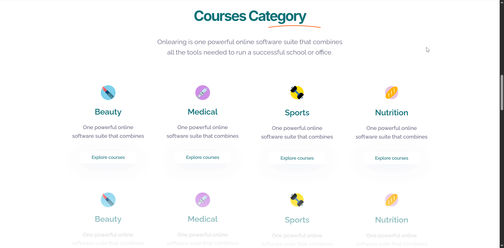
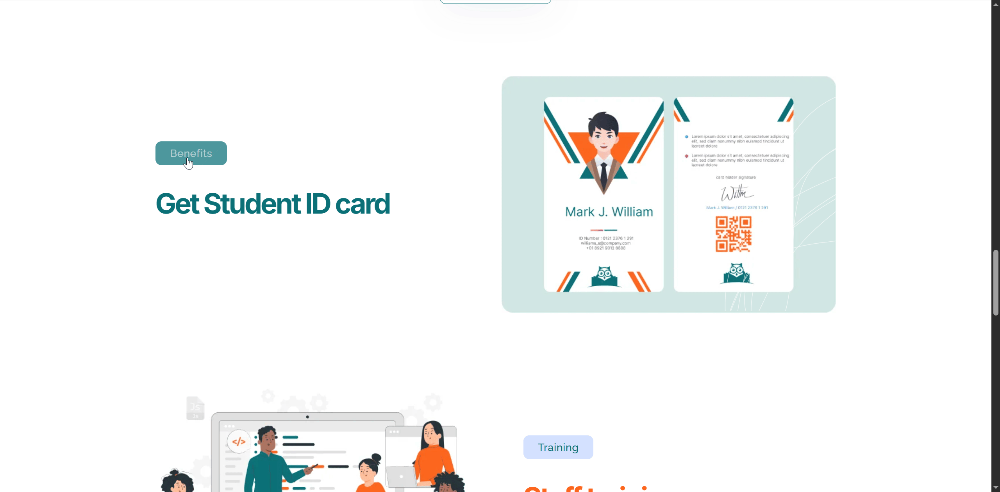
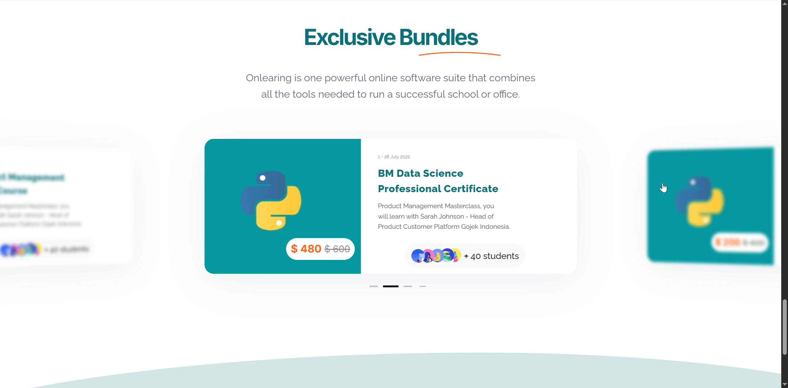
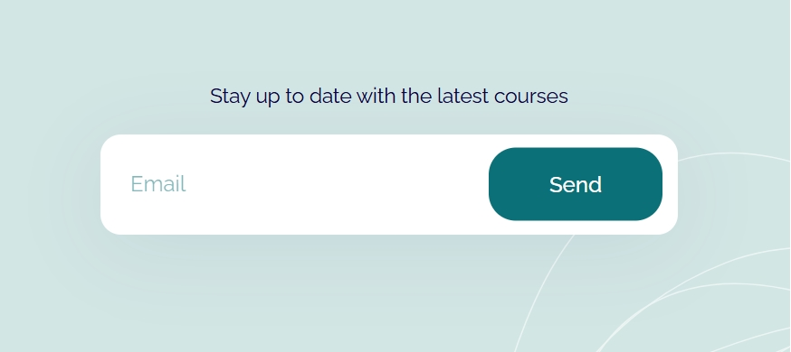
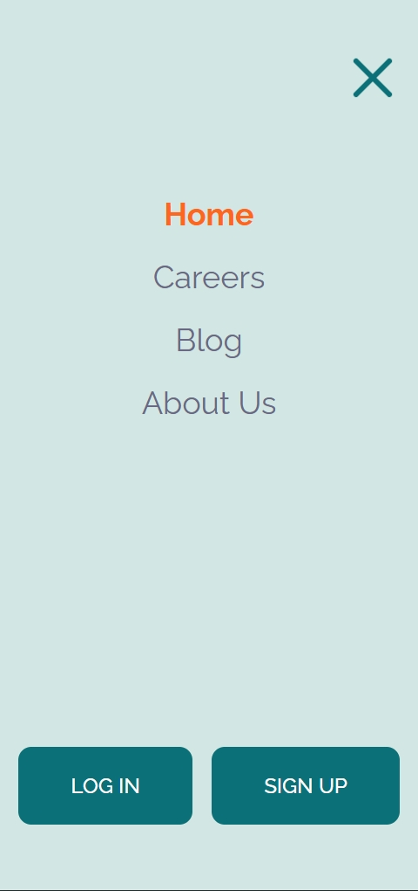

# 🎓 Onlearn – веб-сайт для онлайн-курсов

Многостраничный сайт онлайн-курсов с адаптивной версткой, интерактивными UI-элементами и серверным взаимодействием.

## Стек технологий


## 🌐 Веб-сайт
Вы можете ознакомиться с сайтом [здесь](https://onlearn.vercel.app/).

## 📌  Основные функциональные возможности
### 🔐  Формы регистрации и входа в систему
- Формы открываются в модальных окнах.
- Проверка на стороне клиента гарантирует, что запросы не будут отправлены с неверными данными.
- Данные отправляются на сервер с помощью POST-запросов.
- Пользователи получают уведомления об успешном выполнении или ошибках.

|  |  |
|:--:|:--:|
| Форма регистрации | Форма логина |

|  |  |
|:--:|:--:|
| Успешная регистрация | Успешный логин |

|  |  |
|:--:|:--:|
| Ошибка регистрации | Ошибка логина |

|  |  |
|:--:|:--:|
| Сообщение об ошибке в офлайн-режиме | Предупреждение в случае несовпадения пароля |

### ▶ Видео в модальном окне

<table>
  <thead>
    <tr>
      <th align="center">
        
      </th>
    </tr>
  </thead>
  <tbody>
    <tr>
      <td align="center">
        При нажатии на кнопку <code>Explore More</code> открывается модальное окно
        с видеороликом из YouTube.
      </td>
    </tr>
  </tbody>
</table>

### 📥 GET-запросы для карточек
<table>
  <thead>
    <tr>
      <th align="center">
        
      </th>
      <th align="center">
        
      </th>
      <th align="center">
        
      </th>
    </tr>
  </thead>
  <tbody>
    <tr>
      <td colspan="3" align="center">
        В нескольких разделах представлены карточки с информацией,
        загружаемой с сервера с помощью GET-запросов.
      </td>
    </tr>
  </tbody>
</table>

### ✨ Интерактивные элементы интерфейса
<table>
  <thead>
    <tr>
      <th align="center">
        
      </th>
      <th align="center">
        
      </th>
      <th align="center">
        
      </th>
    </tr>
  </thead>
  <tbody>
    <tr>
      <td align="center">Табы</td>
      <td align="center">Разворачивающийся список</td>
      <td align="center">Анимированный список</td>
    </tr>
  </tbody>
</table>

### ← → Слайдер
<table>
  <thead>
    <tr>
      <th align="center">
        
      </th>
    </tr>
  </thead>
  <tbody>
    <tr>
      <td align="center">Свайпер-слайдер, реализованный с помощью внешнего <a href="https://swiperjs.com">плагина</a>.</td>
    </tr>
  </tbody>
</table>

### 🔔 Форма подписки
<table>
  <thead>
    <tr>
      <th align="center">
        
      </th>
    </tr>
  </thead>
  <tbody>
    <tr>
      <td align="center">Простая форма подписки с отправкой данных на сервер.</td>
    </tr>
  </tbody>
</table>

### ☰ Бургер-меню
<table>
  <thead>
    <tr>
      <th align="center">
        
      </th>
    </tr>
  </thead>
  <tbody>
    <tr>
      <td align="center">Для навигации в мобильной версии реализовано бургер-меню.</td>
    </tr>
  </tbody>
</table>

## ⚙️ Особенности сборки
 - **Webpack**:
   - **JavaScript бандлинг**: объединение и обработка файлов JavaScript.
   - **Обработка CSS**: подключение и интеграция стилей через JavaScript-бандл.
 - **Gulp**:
   - **Компиляция SASS в CSS**: использование автопрефиксов, минификация и генерация source map.
   - **Оптимизация изображений**: преобразование в WebP и обработка расширений файлов.
   - **Транспиляция JavaScript**: преобразование JavaScript-кода с помощью Babel и последующая сборка через Webpack.
  
## 🚀 Как запустить проект

1. Клонируйте репозиторий:
   ```bash
   git clone https://github.com/Afkeomre/onlearn.git
   
2. Установите зависимости:
   ```bash
   npm install
   
3. Запустите проект, чтобы начать сборку в режиме разработки:
   ```bash
   gulp

3. Запустите проект для создания продакшен-сборки:
   ```bash
   gulp docs

## 📧 Контакты
Если у вас есть какие-либо вопросы или предложения, напишите мне:
- Email: ivoronkova538@yandex.ru.
- GitHub: [Irina Voronkova](https://github.com/Afkeomre).
